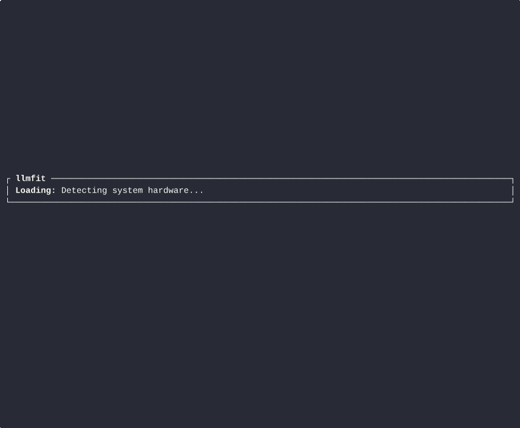

# LLMFit

<p align="center">
  
</p>

<p align="center">
  <a href="https://github.com/miounet11/llmfit/actions/workflows/ci.yml"></a>
  <a href="https://github.com/miounet11/llmfit/releases"></a>
  <a href="LICENSE"></a>
</p>

**Choose the right open model for your hardware before you waste time downloading the wrong one.**

LLMFit is a hardware-aware model selection tool for local AI builders, platform
teams, consultants, and homelab operators. It inspects CPU, RAM, GPU, VRAM, and
local runtimes, then recommends the best-fitting models, quantizations, and run
paths for your machine.

This repository packages the original `AlexsJones/llmfit` engine as a more
complete open-source product: sharper messaging, cleaner install flow, deployable
site assets, local stack orchestration, and repo hygiene that makes the project
easier to adopt and operate.



## Who this is for

- Builders shipping local AI apps on laptops, workstations, and edge servers
- Platform and MLOps teams standardizing which models can run on which nodes
- Consultants who need fast answers on "what model fits this box?"
- Power users running Ollama, llama.cpp, MLX, or Docker Model Runner locally

## Why users pick LLMFit

- **Hardware-aware recommendations**: stop guessing whether a 7B, 14B, 32B, or MoE model will actually fit.
- **TUI, CLI, and API**: use the tool interactively or script it into schedulers, agents, and setup flows.
- **Provider-aware results**: compare model options across Ollama, GGUF, MLX, and Docker runtimes.
- **Planning mode**: invert the workflow and ask what hardware is needed for a model and latency target.
- **Low-friction deployment**: run the binary locally, ship the API in a container, and deploy the product site independently.

## Product direction

The packaging of this fork takes cues from high-adoption open-source products:

- the install simplicity and distribution mindset of [Ollama](https://github.com/ollama/ollama)
- the release quality and tool-first polish seen in [uv](https://github.com/astral-sh/uv)
- the self-hosted product presentation popularized by [Open WebUI](https://github.com/open-webui/open-webui)

## Install

### Quick install

```sh
curl -fsSL https://raw.githubusercontent.com/miounet11/llmfit/main/install.sh | sh
```

Install to `~/.local/bin` without sudo:

```sh
curl -fsSL https://raw.githubusercontent.com/miounet11/llmfit/main/install.sh | sh -s -- --local
```

### From source

```sh
git clone https://github.com/miounet11/llmfit.git
cd llmfit
cargo build --release
./target/release/llmfit
```

### Docker

```sh
docker run --rm ghcr.io/miounet11/llmfit recommend --json --limit 5
```

### Full local stack

```sh
docker compose up --build
```

- API: `http://127.0.0.1:8787`
- Site: `http://127.0.0.1:8080`

## Fast start

```sh
# launch the TUI
llmfit

# top recommendations for coding
llmfit recommend --json --use-case coding --limit 3

# inspect detected hardware
llmfit system

# plan required hardware for a specific model
llmfit plan "Qwen/Qwen3-4B-MLX-4bit" --context 8192 --target-tps 25

# run the node-local REST API
llmfit serve --host 0.0.0.0 --port 8787
```

## What ships in this repo

- `llmfit-core/`: scoring, hardware detection, model catalogs, plan estimation
- `llmfit-tui/`: terminal UI, classic CLI, and REST API
- `llmfit-desktop/`: desktop wrapper for macOS users
- `site/`: static marketing and docs site ready for independent deployment
- `deploy/`: isolated Nginx and Compose assets for low-risk site rollout

## Typical workflows

### 1. Pick the best model for a laptop or workstation

Open the TUI, filter by use case, compare candidates, and download a runnable
model from the runtime that already exists on the machine.

### 2. Standardize a team baseline

Run `llmfit recommend --json` or `llmfit serve` across nodes and feed the output
into a scheduler, inventory system, or setup script.

### 3. Plan an upgrade before buying hardware

Use `llmfit plan` or TUI Plan mode to estimate the RAM, VRAM, and CPU needed to
hit a target model and latency range.

## Site and deployment

The repository includes a dedicated static product site under `site/` and a safe
deployment recipe that keeps the site isolated from existing services by default.

- Local preview: `make site-preview`
- Local stack: `make stack-up`
- Production deployment guide: [docs/DEPLOYMENT.md](docs/DEPLOYMENT.md)

## API and data references

- REST API details: [API.md](API.md)
- Model catalog notes: [MODELS.md](MODELS.md)

## Attribution

This project is based on the original MIT-licensed work by Alex Jones. See
[NOTICE](NOTICE) for the packaging and attribution note for this fork.

## License

MIT. See [LICENSE](LICENSE).
